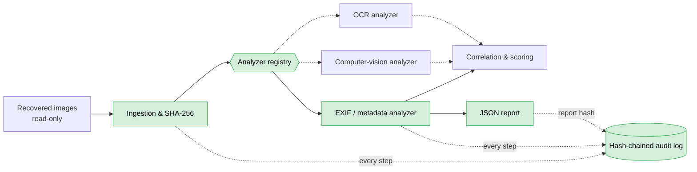

# afa-pipeline-core

[](https://github.com/dorirri/afa-pipeline-core/actions/workflows/ci.yml)
[](https://github.com/dorirri/afa-pipeline-core/actions/workflows/release.yml)
[](LICENSE)


Core modules of the **Android Forensic Analysis Pipeline (AFA-Pipeline)**, a diploma
project that analyses images recovered from Android devices for digital-forensic
investigations. This repository contains the first, fully tested building blocks:

| Module | Requirement | What it does |
|---|---|---|
| `afa_pipeline.ingestion` | FR1 | Read-only intake of evidence files, SHA-256 hash, `EvidenceItem` |
| `afa_pipeline.analyzers.exif` | FR2 | EXIF extraction (device, timestamps, GPS) and anomaly detection |
| `afa_pipeline.analyzers.base` / `registry` | FR9 | `Analyzer` plugin interface and registry |
| `afa_pipeline.provenance` | FR8 | Append-only, hash-chained JSON Lines audit log with `verify()` |
| `afa_pipeline.cli` | — | `afa analyze`, `afa verify-log`, `afa analyzers` |

> **No real evidence data.** This repository contains no real photographs, case data,
> personal data, credentials or model weights. Every image used by the tests is
> generated synthetically at test time in a temporary directory.

## Architecture

AFA-Pipeline is a **pipes-and-filters** pipeline with **pluggable analyzers**. Evidence
enters through a read-only ingestion stage that hashes every file. Independent analyzer
*filters* then run behind a common `Analyzer` interface and are discovered through a
registry. Their results feed a correlation and scoring stage. Cross-cutting services
(provenance/audit, integrity, security) wrap every stage. This repository implements the
parts shown in green below:



Green boxes are implemented in this repository; dashed links lead to [roadmap](#roadmap) items.

## Design principles

- **Evidence is never modified.** Evidence files are opened only with `open(path, "rb")`.
  They are never copied, moved or symlinked, and the CLI refuses to write its report or
  log into the evidence folder. Tests check that bytes and modification times don't change
  and that analysis works on read-only files.
- **Every operation is logged in a tamper-evident way.** Each audit record holds the
  SHA-256 of the previous record. Changing, inserting, deleting or reordering a record
  breaks the chain, and `afa verify-log` detects it. The final record contains the SHA-256
  of the JSON report, which binds report and log together.
- **Pluggable analyzers.** An analyzer is a subclass of `Analyzer` with `name`, `version`
  and `analyze(item) -> AnalysisResult`. It registers with `@register` or through the
  `afa_pipeline.analyzers` entry-point group. `Analyzer.run()` contains exceptions, so a
  failing plugin or a corrupted file can't stop the run.
- **Reproducible and deterministic.** Output JSON has sorted keys and a stable file order.
  Every result records the tool and analyzer versions. Runtime dependencies are bounded
  and dev tools are pinned exactly.
- **Offline.** No network access at runtime. The Docker image runs with `--network none`.
- **Findings are evidence-backed.** Every anomaly is a `Finding` with a `rule` id, a
  `confidence` in [0, 1] and the concrete `evidence` values that triggered it.

## Installation

Requires Python 3.10 or newer.

```bash
git clone https://github.com/dorirri/afa-pipeline-core.git
cd afa-pipeline-core
python -m venv .venv
source .venv/bin/activate        # Windows: .venv\Scripts\activate
pip install .                    # or: pip install -e ".[dev]" for development
```

Or install a released wheel from the [Releases page](https://github.com/dorirri/afa-pipeline-core/releases):

```bash
pip install afa_pipeline_core-0.1.1-py3-none-any.whl
```

Or use the Docker image:

```bash
docker pull ghcr.io/dorirri/afa-pipeline-core:latest
```

## Usage

```bash
afa analyze ./evidence --out out/results.json --log out/audit.jsonl
```

Example output for a folder of synthetic test images:

```text
OK   evidence/DCIM/IMG_0001.jpg  0 finding(s)
OK   evidence/DCIM/IMG_0002.jpg  2 finding(s)
ERR  evidence/DCIM/IMG_0003.jpg  corrupted image: image file is truncated (52 bytes not processed)
SKIP evidence/notes.txt  not a recognised image
OK   evidence/screenshot.png  1 finding(s)

5 file(s): 3 analysed, 1 skipped, 1 error(s), 3 finding(s)
report:     out/results.json
audit log:  out/audit.jsonl
audit head: 23b4acbc3affd2b7cab498a0675aa6bbb200f8673fad32d5118c4da1ab4e371b
```

Corrupted, truncated and non-image files are reported and skipped. They never crash the
run. Keep the printed **audit head** in your case notes: passing it to `verify-log` also
detects records removed from the end of the log.

```bash
afa verify-log out/audit.jsonl --expected-head 23b4acbc…
# OK: 12 record(s), chain intact, head 23b4acbc…
afa analyzers
# exif 1.0.0
```

An excerpt of `results.json` for `IMG_0002.jpg`:

```json
{
  "analyzer": "exif",
  "analyzer_version": "1.0.0",
  "status": "ok",
  "findings": [
    {
      "rule": "exif.editing_software",
      "confidence": 0.9,
      "message": "Software tag names an image editor",
      "evidence": {"matched": "adobe photoshop", "tag": "Software", "value": "Adobe Photoshop 25.0 (Windows)"}
    },
    {
      "rule": "exif.timestamp_inconsistency",
      "confidence": 0.5,
      "message": "DateTimeOriginal and DateTime differ by 44 days, 22:00:00; the file was modified after capture",
      "evidence": {"DateTime": "2024-06-15T08:00:00", "DateTimeOriginal": "2024-05-01T10:00:00", "difference_seconds": 3880800}
    }
  ]
}
```

### With Docker (offline, evidence mounted read-only)

```bash
docker run --rm --network none --user "$(id -u):$(id -g)" \
  -v "$PWD/evidence:/evidence:ro" -v "$PWD/out:/out" \
  ghcr.io/dorirri/afa-pipeline-core:latest \
  analyze /evidence --out /out/results.json --log /out/audit.jsonl
```

### Anomaly rules of the EXIF analyzer

| Rule | Fires when | Confidence |
|---|---|---|
| `exif.missing` | No EXIF block at all | 0.6 for JPEG/TIFF/HEIF/WebP, 0.3 for formats that rarely carry EXIF (e.g. PNG) |
| `exif.timestamp_inconsistency` | `DateTimeOriginal` ≠ `DateTimeDigitized` (> 2 s) | 0.8 |
| | `DateTimeOriginal` ≠ `DateTime` (> 2 s): modified after capture | 0.5 |
| | `DateTimeOriginal` later than the file modification time (beyond the time-zone tolerance, or > 1 min when `OffsetTimeOriginal` is set) | 0.6 |
| `exif.timestamp_malformed` | A timestamp is not a valid `YYYY:MM:DD HH:MM:SS` | 0.7 |
| `exif.editing_software` | `Software`/`ProcessingSoftware` names an editor (Photoshop, GIMP, Snapseed, Lightroom, PicsArt, …) | 0.9 |
| `exif.gps_malformed` | GPS present but incomplete, non-numeric, zero denominator, out of range or invalid hemisphere | 0.9 |
| | GPS exactly at 0°, 0° ("null island") | 0.5 |

Confidence values are heuristic weights that rank findings for an investigator. They are
not calibrated probabilities. Missing EXIF, for example, is common for messenger or
screenshot images.

### Writing a new analyzer

```python
from afa_pipeline.analyzers import AnalysisResult, AnalysisStatus, Analyzer, register
from afa_pipeline.ingestion import EvidenceItem


@register
class FileSizeAnalyzer(Analyzer):
    name = "filesize"
    version = "0.1.0"

    def analyze(self, item: EvidenceItem) -> AnalysisResult:
        return self.result(item, AnalysisStatus.OK, data={"bytes": item.size})
```

External packages can expose analyzers through the `afa_pipeline.analyzers` entry-point
group and load them with `default_registry.load_entry_points()`.

## Running the tests

```bash
pip install -e ".[dev]"
pytest --cov                     # fails under 85 % coverage
ruff check . && ruff format --check .
mypy
pre-commit install               # run the same checks on every commit
```

The tests generate all their images with Pillow, writing EXIF through `PIL.Image.Exif`.
They cover hashing and read-only behaviour, every anomaly rule (positive and negative),
corrupted/truncated/non-image files, the registry, audit-log tampering, the CLI end to
end, and deterministic output.

CI ([`ci.yml`](.github/workflows/ci.yml)) runs lint, type checking and the tests on Python
3.10, 3.11 and 3.12 (Ubuntu) and 3.12 (Windows), plus one job against the oldest supported
Pillow, for every push and pull request to `main`.
Pushing a `v*.*.*` tag triggers [`release.yml`](.github/workflows/release.yml), which
builds the sdist and wheel, creates a GitHub Release and pushes the Docker image to GHCR.

## Technology stack

| Concern | Choice |
|---|---|
| Language | Python ≥ 3.10 |
| EXIF | Pillow (only runtime dependency) |
| Packaging | `pyproject.toml` (PEP 621) + setuptools, `src/` layout |
| Tests | pytest + pytest-cov |
| Lint / format | ruff |
| Types | mypy (strict) |
| Hooks | pre-commit |
| CI/CD | GitHub Actions, GitHub Releases, GHCR |
| Container | `python:3.12-slim`, multi-stage, non-root |

The reasons for each choice and the alternatives considered are in
[`docs/TECH_CHOICES.md`](docs/TECH_CHOICES.md).

## Roadmap

- **Computer-vision analyzer**: object, weapon and face detection as an `Analyzer` plugin
  with pinned, checksummed model weights loaded from a local path (never downloaded at
  runtime).
- **OCR analyzer**: text extraction from screenshots and photos.
- **Correlation & scoring**: combine findings from all analyzers per item and across
  items (timelines, location clusters) into a ranked case view.
- **Integrity analyzer**: error-level and JPEG-ghost analysis.
- **External anchoring of the audit head**: for example signing it, or timestamping it on
  a public ledger, to protect against an attacker who rewrites the whole log.

## Contributing, changelog, citation

See [CONTRIBUTING.md](CONTRIBUTING.md), [CHANGELOG.md](CHANGELOG.md) and
[CITATION.cff](CITATION.cff).

## License

[MIT](LICENSE)
